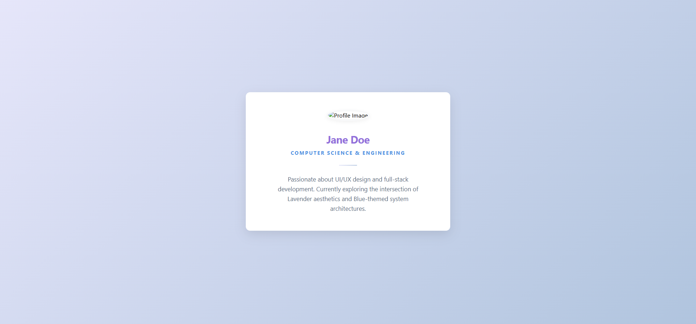

# Student Profile Card Project

A modern, responsive, and aesthetically pleasing Student Profile Card built with HTML and CSS. This project demonstrates clean UI design principles, including gradients, soft shadows, and subtle animations.

## ✨ Features

- **Lavender & Blue Theme:** A soothing color palette using CSS variables for easy customization.
- **Responsive Design:** Optimized for various screen sizes with a clean, centered layout.
- **Subtle Animations:** Features a smooth fade-in and slide-up entry animation on page load.
- **Interactive Hover Effects:** A gentle lavender glow appears when hovering over the card.
- **Clean Typography:** Uses a modern sans-serif font stack for high readability.

## 🛠️ Technologies Used

- **HTML5:** Semantic structure for the profile content.
- **CSS3:** 
    - Flexbox for centering and layout.
    - Linear gradients for the background and accents.
    - `@keyframes` for the entrance animation.
    - Custom Properties (CSS Variables) for theme management.

## 📂 File Structure

- `index.html`: The main application file containing both structure and styling.
- `prompts.md`: A log of the AI prompts used to generate and refine this project.
- `README.md`: Project documentation (this file).

## 🚀 How to View

To view the profile card, simply open the `index.html` file in any modern web browser.

---

## 🤖 Development Process

This project was completed as part of an assignment to gain familiarity with AI tools and natural language-driven development. 

It is a **Vibe Coded** project, meaning it was built and iteratively refined through conversation with an AI assistant to achieve a specific aesthetic and functional goal.
